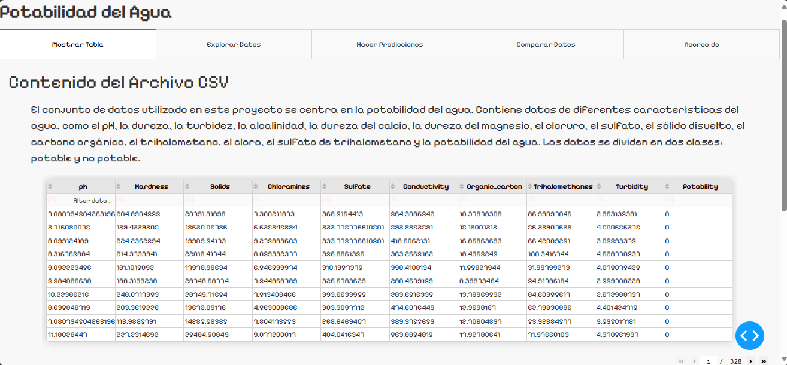
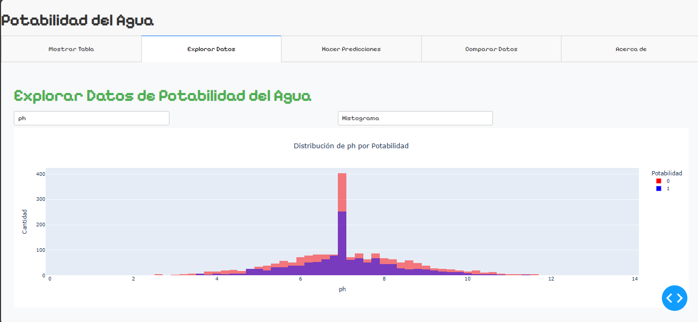
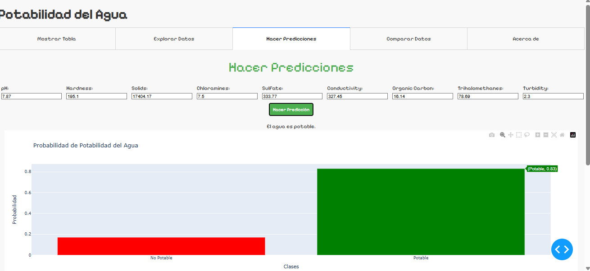
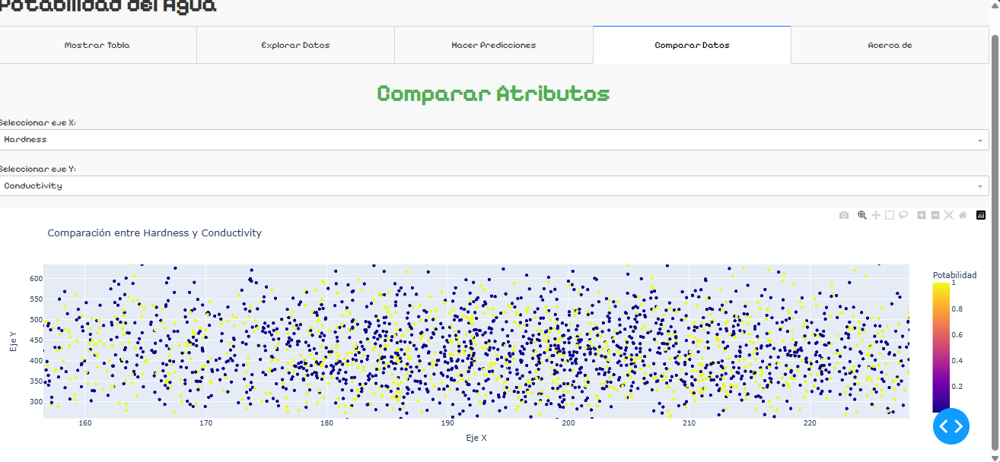

## Installation

Clone the repository:

```bash
git clone https://github.com/Nestor-DS/DASHDL4TD_.git
```
    
Install the libraries:

**Conda:**
```bash
pip install -r requirements.txt
```

**Python:**
```bash
conda install --file requirements.txt
```

## Deployment

To deploy this project, run:

```bash
python index.py
```

---


```
dashdl4td/
│
├── assets/
│   └── styles.css
│
├── data/
│   └── drinking_water_potability.csv
│
├── models/
│   ├── best_model.json
│   ├── mrd.pkl
│   └── best_model_weights.h5
│
├── pages/
│   ├── __init__.py
│   ├── explore_data.py
│   ├── compare_data.py
│   ├── show_table.py
│   └── make_predictions.py
│
├── app.py
├── index.py
└── requirements.txt
```

## Interfaz:

### Ver dataset:



### Explorar datos:



### Realizar predicciones:



### Comparar datos:


