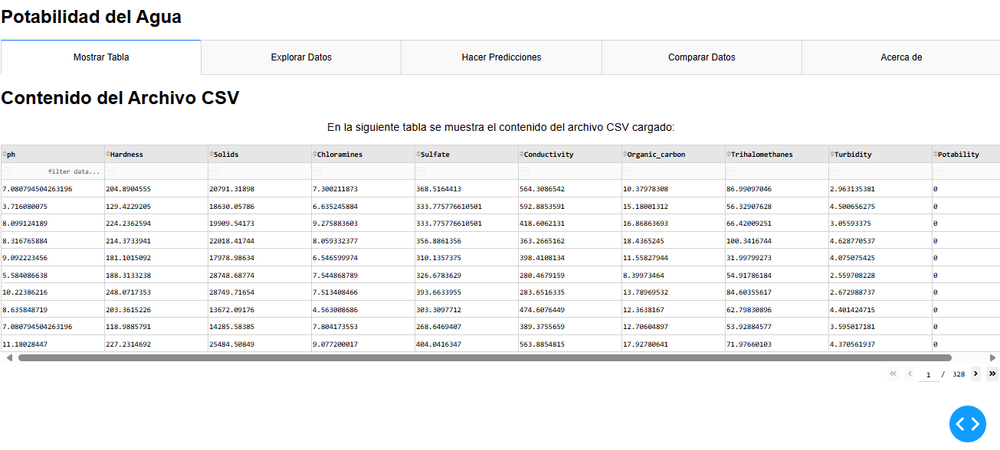

```
mi_aplicacion_dash/
│
├── assets/
│   └── styles.css
│
├── data/
│   └── drinking_water_potability.csv
│
├── models/
│   ├── best_model.json
│   └── best_model_weights.h5
│
├── pages/
│   ├── __init__.py
│   ├── explore_data.py
│   └── make_predictions.py
│
├── app.py
└── requirements.txt
```

## Interfaz:

